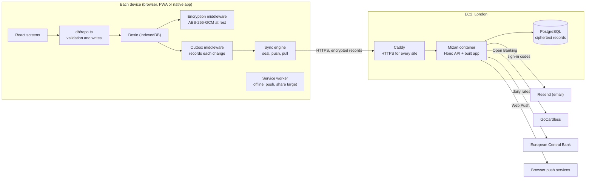
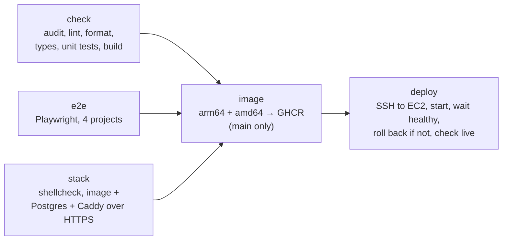

# Mizan: project documentation

Everything about the project in one place: what it is, how it is built, how it is tested, released and run. Deeper dives live in the other files in [`docs/`](.) and are linked where relevant.

**Contents**

1. [Overview](#1-overview)
2. [Features](#2-features)
3. [Architecture](#3-architecture)
4. [Repository layout](#4-repository-layout)
5. [Technology](#5-technology)
6. [The app (client)](#6-the-app-client)
7. [Data model](#7-data-model)
8. [Security and privacy](#8-security-and-privacy)
9. [Sync and households](#9-sync-and-households)
10. [The server (API)](#10-the-server-api)
11. [Development](#11-development)
12. [Build](#12-build)
13. [Testing](#13-testing)
14. [CI/CD](#14-cicd)
15. [Deployment](#15-deployment)
16. [Operations](#16-operations)
17. [Configuration reference](#17-configuration-reference)
18. [Native apps](#18-native-apps)
19. [Conventions](#19-conventions)
20. [Further reading](#20-further-reading)

---

## 1. Overview

**Mizan** (ميزان, "balance") is a personal finance app for phones and computers, in English, French and Arabic. Its full name for stores and the website is **Mizan: Safe to Spend**: its central idea is telling you what you can safely spend until payday, after the bills still to come.

It is **local-first**: all data lives on the device (IndexedDB), the app works offline and without an account, and nothing is sent anywhere by default. An optional **sync account** keeps several devices and a partner's devices in step; the data is **end-to-end encrypted** on the device before upload, so the server stores only ciphertext.

|            |                                                        |
| ---------- | ------------------------------------------------------ |
| Live app   | https://mizan.tarikelberrak.com                        |
| Repository | https://github.com/telberrak/personal-finance (public) |
| Hosting    | One AWS EC2 instance in London (eu-west-2)             |
| Version    | See `package.json` and [CHANGELOG.md](../CHANGELOG.md) |

Internal identifiers still carry the working name **Ledger** (the IndexedDB name `ledger`, encryption labels such as `ledger-vault`, backup format ids, `LEDGER_*` environment variables, the `ledger-*` launch configurations). They must not be renamed: existing data, backups and vaults depend on them.

## 2. Features

| Area             | What it does                                                                                                                                 | Code                                                                       |
| ---------------- | -------------------------------------------------------------------------------------------------------------------------------------------- | -------------------------------------------------------------------------- |
| Safe to spend    | Everyday balance minus bills due before payday minus savings, per day until payday                                                           | `lib/selectors.ts`, `pages/Home.tsx`                                       |
| Accounts         | Current, savings, cash, credit cards, loans, mortgages, investments, pensions, property; per-account currency                                | `pages/Accounts.tsx`                                                       |
| Transactions     | Expenses, income, transfers, splits, tags, notes, receipts, foreign amounts                                                                  | `pages/TransactionForm.tsx`, `db/repo.ts`                                  |
| Categorisation   | Rules, payee renames, a UK merchant directory, learning from corrections                                                                     | `lib/rules.ts`, `lib/merchants.ts`, `lib/learn.ts`                         |
| Bills            | Weekly, monthly, yearly; direct debits, standing orders, card subscriptions; matching payments, price-rise alerts, suggestions, free trials  | `pages/Bills.tsx`, `lib/matching.ts`, `lib/recurring.ts`                   |
| Budgets          | Monthly or payday-to-payday, rollover, alerts; household budgets                                                                             | `pages/Budgets.tsx`                                                        |
| Goals            | Savings targets with dates and monthly amounts                                                                                               | `pages/Goals.tsx`                                                          |
| Reports          | By category, by month, top payees, forecast, comparisons, trends, Year in review, tax helper (UK, France)                                    | `lib/reports.ts`, `lib/forecast.ts`, `lib/tax.ts`                          |
| Calendar         | Bills, paydays and expected balance day by day                                                                                               | `lib/calendar.ts`                                                          |
| Net worth        | Assets and debts with history; debt payoff planner (avalanche, snowball)                                                                     | `lib/networth.ts`, `lib/debt.ts`                                           |
| Import           | CSV from most UK and French banks, column mapping, duplicate detection, undo                                                                 | `lib/importer.ts`, `lib/importPrep.ts`                                     |
| Bank connections | Open Banking through GoCardless (or a sandbox bank), 90-day consent                                                                          | `banks/`, `server/banks.ts`                                                |
| Receipts         | Photos and PDFs, on-device OCR (Tesseract), return-by and warranty reminders                                                                 | `components/Receipts.tsx`, `lib/ocr.ts`, `lib/receipt.ts`                  |
| Search           | Advanced filters, saved searches, bulk edit                                                                                                  | `lib/search.ts`, `pages/Search.tsx`                                        |
| Notifications    | 11 alert types, quiet hours, Web Push and native notifications                                                                               | `lib/alerts.ts`, `notify/`, `server/push.ts`                               |
| Sharing          | Households (shared accounts, bills, budgets, categories); splitting costs with friends                                                       | `sync/household.ts`, `lib/friends.ts`                                      |
| Security         | App lock (PIN, passkey, biometrics), encryption at rest, encrypted backups, hide amounts                                                     | `db/crypto.ts`, `db/encryption.ts`, `db/security.ts`                       |
| Languages        | English, French, Arabic (right to left), Latin or Arabic-Indic digits, multi-currency with ECB rates                                         | `i18n/`, `locales/`, `lib/format.ts`, `lib/fx.ts`                          |
| Help             | 27 searchable topics with examples, in three languages                                                                                       | `pages/Help.tsx`, `content/help.*.md`                                      |
| News by email    | Opt-in on the website, in Settings and at sync sign-up; consent records, double opt-in, one-click unsubscribe, Resend Broadcasts, CSV export | `server/subscribers.ts`, `components/NewsByEmail.tsx`, `pages/Updates.tsx` |

The phase-by-phase history is in [ROADMAP_PRO.md](ROADMAP_PRO.md) (P1–P14).

## 3. Architecture



Key decisions:

- **Local-first.** The device is the source of truth. Screens read IndexedDB through live queries (`useFinanceData` in `db/db.ts`), so any write re-renders what depends on it. The server is never needed to use the app.
- **One write path.** Every change goes through `db/repo.ts`, which validates input and keeps related records consistent (both sides of a transfer, split parts, household membership).
- **Middleware, not scattered code.** Encryption and change tracking are Dexie DBCore middleware: encryption (level −2) seals records below the app's view of them; the outbox (level −3) records every change to a synced table in the same IndexedDB transaction, so a change and its sync entry are saved together or not at all.
- **The server stores ciphertext.** Records are sealed on the device with keys the server never sees. The server orders records with per-account sequence numbers and keeps account metadata (email, sessions, passkeys).
- **One container.** The production server serves both the API (`/api`) and the built app from the same origin, so the Content-Security-Policy stays `connect-src 'self'` and no CORS is needed (`server/web.ts`).

## 4. Repository layout

```
.github/workflows/ci.yml   CI/CD: checks, end-to-end tests, stack test, image, deploy
deploy/ec2/                Production server: Docker Compose, Caddyfile, setup and backup scripts
docs/                      Documentation (this file and topic guides)
e2e/                       Playwright end-to-end tests
server/                    Sync API (Hono, Node 24, runs TypeScript directly)
shared/api.ts              Types shared by the app and the server
site/                      Static marketing site (EN, FR, AR)
src/
  App.tsx, main.tsx        Root component, routes, start-up
  banks/                   Bank connection client
  components/              Shared UI (layout, rows, dialogs, forms, icons, Markdown, lock screen)
  content/                 Help, privacy policy and terms (Markdown per language)
  db/                      Database schema, repository, encryption, outbox, security, seed data
  i18n/, locales/          i18next setup, pseudo-locales, en/fr/ar strings
  lib/                     Pure logic: money, dates, selectors, reports, import, alerts, tax…
  native/                  Capacitor integration (biometrics, local notifications)
  notify/                  Notification centre and delivery
  pages/                   One file per screen
  styles/                  Design tokens and app CSS
  sync/                    Sync client, keys, engine, households
android/, ios/             Capacitor native projects
public/                    Icons, sw-extra.js (push and share-target handling)
Dockerfile                 Production image (web build + API)
vite.config.ts             Build, PWA, dev server, Vitest
playwright.config.ts       End-to-end test projects and servers
```

## 5. Technology

| Layer    | Choice                                                                           |
| -------- | -------------------------------------------------------------------------------- |
| Language | TypeScript 6 (strict), ES2024                                                    |
| UI       | React 19, React Router 8, hand-written CSS with design tokens (light and dark)   |
| Storage  | IndexedDB through Dexie 4 and dexie-react-hooks                                  |
| Crypto   | WebCrypto (PBKDF2, HKDF, HMAC, passkey PRF) and @noble/ciphers (AES-256-GCM)     |
| i18n     | i18next, ICU plurals (Arabic has all six forms), Intl for numbers and dates      |
| PWA      | vite-plugin-pwa (Workbox), installable, offline, Web Push, share target          |
| OCR      | Tesseract.js, served from the app itself (no CDN)                                |
| Native   | Capacitor 8 (iOS, Android), biometric auth, secure storage, local notifications  |
| Server   | Node 24, Hono 4, PostgreSQL (pg) in production, PGlite for development and tests |
| Auth     | Email codes, passkeys (@simplewebauthn), bearer sessions                         |
| Email    | Resend HTTP API                                                                  |
| Push     | web-push (VAPID)                                                                 |
| Build    | Vite 8                                                                           |
| Tests    | Vitest 5 (jsdom, fake-indexeddb), Testing Library, Playwright with axe-core      |
| Quality  | ESLint 9 (typescript-eslint, react-hooks, jsx-a11y, i18next), Prettier           |
| Hosting  | AWS EC2 (t4g.small, Graviton), Docker Compose, Caddy 2, PostgreSQL 17            |
| CI/CD    | GitHub Actions, GitHub Container Registry                                        |

## 6. The app (client)

**Start-up** (`src/main.tsx`): sets up i18n and formatting from saved settings, opens the database, registers the service worker, and renders `App`. If an app lock is set, `App` shows only the lock screen until the data key is unlocked; no other screen (and no query) runs while locked.

**Routing** (`src/App.tsx`): main screens (Home, Activity, Bills, Budgets, Settings, the transaction form) are in the start-up bundle; the rest load on first visit (`lazy`). Phones get a bottom tab bar with the add button; computers get a sidebar with every section (`components/Layout.tsx`). Forms and settings screens hide the phone tab bar.

**Reading data:** `useFinanceData()` loads every table the screens need as one live object (`FinanceData`). Amounts in other currencies are converted to the home currency for display (`inHomeCurrency`), keeping originals under `native` (view only: `repo.ts` strips it on save).

**Logic** lives in `src/lib/` as pure functions of the data (selectors, reports, forecasts, alerts, matching, import), which keeps it easy to unit test.

**Money** is stored as integer minor units (`Pence`), never floats. Formatting goes through `lib/money.ts` and `lib/format.ts`, which handle the language, digits, currency symbols and right-to-left isolation of amounts.

**Languages:** every visible string comes from `src/locales/{en,fr,ar}.json` through `t()`; ESLint rejects literal text in JSX. Arabic switches the document to right to left. Pseudo-locales (`en-XA`, `ar-XB`) wrap every string so tests can find untranslated text. See [TRANSLATING.md](TRANSLATING.md).

**PWA:** the service worker precaches the app (the 12 MB OCR files are excluded and fetched only when needed), shows Web Push notifications, and accepts shared files (receipts) through the share target (`public/sw-extra.js`). Updates are offered with a prompt rather than applied silently.

**Notifications:** alerts are worked out on the device from the data every minute (`lib/alerts.ts`) and listed in the notification centre. Delivery respects per-type settings and quiet hours; with sync on, reminders are also scheduled on the server for Web Push, holding only a time and a generic sentence.

## 7. Data model

Types are in [`src/db/types.ts`](../src/db/types.ts). Main tables (IndexedDB, database `ledger`):

| Table                                                                                     | Holds                                                                                                 | Synced |
| ----------------------------------------------------------------------------------------- | ----------------------------------------------------------------------------------------------------- | ------ |
| `accounts`                                                                                | Accounts and their type-specific fields, currency, household (`spaceId`)                              | yes    |
| `transactions`                                                                            | Amount (minor units, signed), date, payee, category, links to bill, transfer, split, import           | yes    |
| `categories`                                                                              | Built-in and custom categories, colour, order                                                         | yes    |
| `recurring`                                                                               | Bills: amount, frequency, start, end, method, trial end, price history                                | yes    |
| `budgets`                                                                                 | Limit per category, optionally a household's                                                          | yes    |
| `rules`, `payeeAliases`                                                                   | Categorisation rules and payee renames                                                                | yes    |
| `goals`, `importBatches`, `bankConnections`, `attachments`, `people`, `ious`, `spaceKeys` | As named                                                                                              | yes    |
| `settings`                                                                                | One record: preferences, pay cycle, FX rates, saved searches… (device-only fields excluded from sync) | yes    |
| `keyring`                                                                                 | The data key, wrapped by the PIN and each passkey                                                     | no     |
| `outbox`, `syncState`, `notices`                                                          | Pending sync changes, sync session and cursors, alerts already shown                                  | no     |

**Schema versions** are declared in `db/db.ts` (currently v8). The rule: never edit a released version; add `version(n + 1)` with an upgrade and a migration test in `db/db.test.ts`.

**Backups** are JSON files of every table (`createBackup`), optionally encrypted with a password; the format id `ledger-backup` stays for compatibility.

## 8. Security and privacy

The full threat model is in [SECURITY.md](SECURITY.md). In short:

- **Encryption at rest (app lock on):** a random 256-bit data key encrypts every record with AES-256-GCM. Only primary keys and indexed fields (dates, ids) stay readable on disk. The data key is stored only wrapped: by a key derived from the PIN (PBKDF2-SHA256), by each passkey (WebAuthn PRF), or in the native keychain behind biometrics. While locked, the key is not in memory.
- **Sync encryption:** see section 9. The server never sees readable data or keys.
- **Backups:** optional password encryption (PBKDF2 + AES-256-GCM).
- **Web hardening:** a strict Content-Security-Policy (no third-party scripts, styles or connections), HSTS, frame denial, no referrer, a restrictive permissions policy. Defined once in [`security-headers.ts`](../security-headers.ts) and applied by the server, `vite preview`, Netlify and Vercel configs (a test checks they match).
- **News by email:** opt-in only (never pre-ticked), consent recorded with its wording, double opt-in for typed addresses, one-click unsubscribe (RFC 8058 headers), mirrored to Resend for Broadcasts; deleted with the sync account.
- **Privacy:** no ads, no trackers, no cookies. Opt-in anonymous usage counts are daily totals per event name only. Server logs never contain request bodies, emails or tokens.
- **Server:** rate limits on sign-in (20 code requests per address per hour, 5 per email per 15 minutes; codes expire after 10 minutes and allow 5 tries), the visitor address taken only from Caddy's `X-Forwarded-For`, one-use household invites.

## 9. Sync and households

**Keys** ([`sync/keys.ts`](../src/sync/keys.ts)): an account has one random 256-bit **sync key**. The server keeps it only inside a **vault** encrypted with a key derived from the **recovery key** (160 random bits, shown once as 8 groups of Crockford base32). Records are sealed with a key derived from the sync key (AES-256-GCM); each record's server id is an HMAC of its table and id, so the server cannot tell records apart.

**Engine** ([`sync/engine.ts`](../src/sync/engine.ts)):

1. **Pull** each stream since its cursor and apply records, skipping any record changed here and not yet pushed.
2. **Push** the outbox in batches: every record to your own stream; shared records (with a `spaceId`) also to their household's stream, with the custom categories they use; deletions to all.
3. Conflicts are per record: the last device to push wins, and linked records (split parts, both sides of a transfer) travel together.

Sync runs on start-up, shortly after any change (when the outbox fills), every minute, and when the app comes back online or into view.

**Households** ([`sync/household.ts`](../src/sync/household.ts), `server/spaces.ts`): each household has its own key, created on the device and passed only in the invite link's `#fragment` (never sent to a server). Households get their own record stream. A household can write only shared tables (accounts, transactions, bills, budgets) and only records belonging to it, plus custom categories (never built-in ones, never deletions). Leaving makes your shared accounts private again and removes the others' from the device.

## 10. The server (API)

Code in [`server/`](../server); types shared with the app in [`shared/api.ts`](../shared/api.ts). Entry point `server/main.ts` reads the environment, opens the database (Postgres with `DATABASE_URL`, otherwise PGlite on disk or in memory), runs migrations, and serves the API (and the built app when `WEB_DIR` is set).

| Routes                                                                                                      | Purpose                                                                               |
| ----------------------------------------------------------------------------------------------------------- | ------------------------------------------------------------------------------------- |
| `GET /api/health`                                                                                           | Database round trip; returns version and environment                                  |
| `POST /api/auth/email/start`, `/verify`                                                                     | Sign in with an emailed 6-digit code                                                  |
| `POST /api/auth/passkey/options`, `/verify`                                                                 | Sign in with a passkey                                                                |
| `GET /api/me`, `DELETE /api/devices/:id`, `POST /api/auth/logout`                                           | Account, devices, sign out                                                            |
| `GET/PUT /api/vault`                                                                                        | The wrapped sync key                                                                  |
| `POST /api/sync/push`, `GET /api/sync/pull?since=N`                                                         | Encrypted records, ordered per account                                                |
| `/api/spaces/…`                                                                                             | Households: create, invite, join, leave, push, pull                                   |
| `/api/push/…`                                                                                               | Web Push key, subscription, reminders                                                 |
| `/api/banks/…`                                                                                              | Bank connections (GoCardless or sandbox)                                              |
| `GET /api/rates`                                                                                            | ECB euro reference rates (cached 6 hours)                                             |
| `POST /api/feedback`, `/api/events`                                                                         | Feedback messages, opt-in usage counts                                                |
| `POST /api/subscribe`, `GET /api/subscribe/confirm`, `GET/POST /api/unsubscribe`, `GET/PUT /api/me/updates` | News by email: opt-in, confirmation link, one-click unsubscribe, the account's choice |
| `DELETE /api/account`                                                                                       | Delete the account and everything stored for it                                       |

**Database** (`server/db.ts`): migrations in order, recorded in `schema_migrations`: 1 core (users, sessions, email codes, passkeys, challenges, vaults, records), 2 push, 3 bank links, 4 households, 5 feedback and usage counts, 6 news subscribers (kept apart from accounts, with their consent record). Never edit a released migration; add one.

**Background work:** due push reminders are sent every minute.

Details and configuration: [SERVER.md](SERVER.md), [OPEN_BANKING.md](OPEN_BANKING.md).

## 11. Development

Requirements: Node 24 (or 22+), npm, and for end-to-end tests Microsoft Edge or Chromium.

```bash
npm install
npm run dev            # the app on http://localhost:5173 (API proxied to :8787)
npm run server:dev     # the API on http://localhost:8787 (PGlite in .ledger-api-data, codes printed)
npm run dev:phone      # the app on your network, for testing on a phone
```

| Script                            | Does                                                                       |
| --------------------------------- | -------------------------------------------------------------------------- |
| `npm run check`                   | Lint, format check, type check, unit tests, build: run before every commit |
| `npm test` / `npm run test:watch` | Unit tests (Vitest)                                                        |
| `npm run test:e2e`                | End-to-end tests (Playwright; starts its own API and preview server)       |
| `npm run serve`                   | Production build served on :4173                                           |
| `npm run format`                  | Prettier on everything                                                     |
| `npm run icons`                   | Regenerates the app icons                                                  |
| `npm run native:sync`             | Builds and copies the app into the iOS and Android projects                |

In the Claude Code desktop app, `.claude/launch.json` defines `ledger-dev`, `ledger-prod` and `ledger-api`.

Notes: stop the dev API with Ctrl+C (PGlite cannot reopen a folder after a hard kill; the server then moves it aside and starts fresh). The sign-in code is printed in the API's log.

## 12. Build

- **Type check:** three projects: the app (`tsconfig.json`), Node config files (`tsconfig.node.json`) and the server (`tsconfig.server.json`, which also includes `security-headers.ts`).
- **App build** (`vite build`): bundles the app with code splitting, injects the version (`__APP_VERSION__`), generates the PWA manifest and service worker, and copies the Tesseract files to `dist/ocr/` (`ocr-assets.ts`). Build-time settings: `VITE_SUPPORT_EMAIL`, `VITE_OPERATOR_NAME`, `VITE_API_ORIGIN` (native apps only).
- **Production image** ([`Dockerfile`](../Dockerfile)): stage 1 builds the web app once on the build machine (`--platform=$BUILDPLATFORM`); stage 2 installs production dependencies and copies the server, shared types and `dist/`, runs as the `node` user, with a health check. Built for **linux/amd64 and linux/arm64** in CI and published to `ghcr.io/telberrak/mizan` tagged with the commit SHA and `latest`.

## 13. Testing

| Layer         | Tool                            | Where                  | What                                                                                             |
| ------------- | ------------------------------- | ---------------------- | ------------------------------------------------------------------------------------------------ |
| Unit          | Vitest (jsdom, fake-indexeddb)  | `src/**/*.test.ts(x)`  | Logic, repository, encryption, sync with an in-process server, Markdown, help topics             |
| Server        | Vitest (node, PGlite in memory) | `server/*.test.ts`     | Every route, migrations, rate limits, web serving                                                |
| End-to-end    | Playwright                      | `e2e/*.spec.ts`        | Real browser against a built app and real API; four projects: phone and desktop × light and dark |
| Accessibility | axe-core in Playwright          | `e2e/a11y.spec.ts`     | Every screen, no serious violations                                                              |
| Translation   | Playwright with pseudo-locales  | `e2e/i18n.spec.ts`     | No untranslated visible text on any screen; every screen works in French and Arabic              |
| Stack         | GitHub Actions                  | `ci.yml` (`stack` job) | The production image, PostgreSQL and Caddy started together and checked over HTTPS               |

End-to-end tests start their own API on port 8788 (in-memory database, `--dev` so tests can read sign-in codes) and a preview server on 4174. On CI they retry up to twice.

## 14. CI/CD

Workflow [`.github/workflows/ci.yml`](../.github/workflows/ci.yml), on every push to `main` and every pull request:



- **image** runs only for pushes to `main`, after all checks pass.
- **deploy** runs only when the repository variable `EC2_DEPLOY` is `true`, in the `production` environment, one at a time. It copies `compose.yml` and `Caddyfile` to the server, pulls the new image (logging in to GHCR with the job's short-lived token), sets `MIZAN_TAG` to the commit, and runs `docker compose up -d --wait`. If the new version is not healthy within 120 seconds, the previous tag is started again and the job fails. It ends by checking `https://<domain>/api/health`.
- Pull-request runs are cancelled when a newer commit arrives; runs on `main` always finish.

Secrets and variables are listed in section 17.

## 15. Deployment

Production is one **t4g.small** EC2 instance (2 vCPU Graviton, 2 GB, Ubuntu LTS arm64, 30 GB encrypted gp3) in **eu-west-2**, with an Elastic IP. Step-by-step setup: [DEPLOY.md](DEPLOY.md).

```
Internet ──443/80──▶ Caddy ──▶ mizan:8787 (API + app) ──▶ postgres:5432
                      │
                      └──▶ other sites (/srv/mizan/sites.d/*.caddy, files in /srv/mizan/sites)
```

- **Docker Compose** ([`deploy/ec2/compose.yml`](../deploy/ec2/compose.yml)) runs Caddy, PostgreSQL 17 and Mizan; data in named volumes.
- **Caddy** ([`Caddyfile`](../deploy/ec2/Caddyfile)) gets and renews Let's Encrypt certificates, redirects HTTP to HTTPS, compresses responses, serves HTTP/3, and sets the visitor address for rate limits. Other sites and domains are one file each in `sites.d`, never touched by deploys.
- **Server setup** ([`setup.sh`](../deploy/ec2/setup.sh), once): Docker, automatic security updates with a 04:00 UTC reboot window, 2 GB swap, key-only SSH, a `deploy` user for GitHub, `/srv/mizan` with a generated database password, nightly backups.
- **DNS:** an A record per domain pointing at the Elastic IP, **not proxied** by Cloudflare (otherwise every visitor would share Cloudflare's addresses and rate limits).
- **Email:** Resend (or any SMTP server, such as Amazon SES), sending from a verified subdomain (`mail.tarikelberrak.com`).

Indicative monthly cost: instance ~$13.70, disk ~$2.80, public IPv4 ~$3.65, snapshots ~$1–2.

## 16. Operations

| Task            | How                                                                                                                                                                                          |
| --------------- | -------------------------------------------------------------------------------------------------------------------------------------------------------------------------------------------- |
| Status          | `cd /srv/mizan && docker compose ps`                                                                                                                                                         |
| Logs            | `docker compose logs -f mizan` (method, route and error only; email failures show the provider's reason)                                                                                     |
| Health          | `https://<domain>/api/health`; add an uptime monitor and a CloudWatch status-check alarm                                                                                                     |
| Change settings | edit `/srv/mizan/.env` (as `deploy`), then `docker compose up -d`                                                                                                                            |
| Roll back       | set `MIZAN_TAG` in `.env` to an earlier commit SHA, then `docker compose up -d`                                                                                                              |
| Add a site      | a `.caddy` file in `sites.d`, files in `sites/`, DNS record, then `docker compose exec caddy caddy reload --config /etc/caddy/Caddyfile`                                                     |
| Backups         | nightly `pg_dumpall` at 03:30 UTC in `/var/backups/mizan` (14 days), optionally copied to S3 (`BACKUP_S3_BUCKET`); daily EBS snapshots via Data Lifecycle Manager (tag `Backup=mizan-daily`) |
| Restore         | see [DEPLOY.md](DEPLOY.md#6-backups-and-restore)                                                                                                                                             |
| Releases        | bump `version` in `package.json`, add a CHANGELOG entry, push to `main`                                                                                                                      |

GitHub's own outages (such as jobs not being picked up) block deploys but not the running service; re-run CI once GitHub's status is green.

## 17. Configuration reference

**Server environment** (set in `/srv/mizan/.env` or by Compose):

| Variable                                                                                             | Meaning                                                                                                                                 |
| ---------------------------------------------------------------------------------------------------- | --------------------------------------------------------------------------------------------------------------------------------------- |
| `DATABASE_URL`, `DATABASE_CA_CERT`                                                                   | PostgreSQL connection; CA certificate for managed databases with their own CA                                                           |
| `PORT`                                                                                               | Default 8787                                                                                                                            |
| `WEB_DIR`                                                                                            | Serve the built app from this folder (`dist` in the image)                                                                              |
| `RP_ID`, `APP_ORIGINS`                                                                               | Passkey relying party (the domain) and allowed app origins (including `capacitor://localhost`, `https://localhost` for the native apps) |
| `MAIL_FROM`, `SMTP_HOST`, `SMTP_PORT`, `SMTP_SECURE`, `SMTP_USER`, `SMTP_PASSWORD`, `RESEND_API_KEY` | Sign-in and news emails, through any SMTP server (used when `SMTP_HOST` is set) or Resend; with neither, they are only logged           |
| `RESEND_SEGMENT_ID`, `PUBLIC_URL`                                                                    | Resend segment for news subscribers (Broadcasts); where links in emails point                                                           |
| `VAPID_PUBLIC_KEY`, `VAPID_PRIVATE_KEY`, `VAPID_SUBJECT`                                             | Web Push; generated once and stored if absent                                                                                           |
| `GOCARDLESS_SECRET_ID`, `GOCARDLESS_SECRET_KEY`, `BANKS_SANDBOX`                                     | Open Banking                                                                                                                            |
| `LEDGER_ENV`, `LEDGER_DEV`, `LEDGER_DATA_DIR`                                                        | Environment name; development helpers (never in production); PGlite folder or `memory`                                                  |
| `MIZAN_DOMAIN`, `POSTGRES_PASSWORD`, `MIZAN_TAG`, `MIZAN_IMAGE`, `BACKUP_S3_BUCKET`                  | Compose and backup settings on the server                                                                                               |

**Build time:** `VITE_SUPPORT_EMAIL`, `VITE_OPERATOR_NAME`, `VITE_API_ORIGIN`.

**GitHub (Settings → Secrets and variables → Actions):**

| Kind     | Name                                         | Purpose                                     |
| -------- | -------------------------------------------- | ------------------------------------------- |
| Secret   | `EC2_HOST`, `EC2_SSH_KEY`, `EC2_KNOWN_HOSTS` | Where and how the deploy job connects       |
| Variable | `MIZAN_DOMAIN`                               | The live domain, for the final health check |
| Variable | `SUPPORT_EMAIL`, `OPERATOR_NAME`             | Baked into the web app                      |
| Variable | `EC2_DEPLOY`                                 | `true` turns deploys on                     |

## 18. Native apps

The same web app is wrapped with **Capacitor** for iOS and Android (`capacitor.config.ts`, app id `app.mizan.money`, name Mizan). Native extras: biometric unlock (the data key kept in the secure keychain), local notifications for reminders, deep links from notifications. Build with `npm run native:sync`, then open Xcode (`native:ios`, needs a Mac) or Android Studio (`native:android`). Store listings use the full name **Mizan: Safe to Spend**. See [NATIVE.md](NATIVE.md).

## 19. Conventions

- **Code:** TypeScript strict; Prettier (140 columns, single quotes); comments explain why, in plain English; every exported function and type has a doc comment.
- **Text:** never hard-code visible text; add keys to all three locale files (see [TRANSLATING.md](TRANSLATING.md)). Long documents (help, legal) are Markdown per language in `src/content/`, and help topics must stay identical in id and order across languages (a test checks).
- **Money and dates:** integer minor units; ISO dates (`YYYY-MM-DD`) in local time; format only at display.
- **Data changes:** through `db/repo.ts`; schema changes as new Dexie versions; server changes as new migrations.
- **Security:** no third-party requests from the app; keep the headers in `security-headers.ts`; never log request bodies, emails or tokens.
- **Commits:** run `npm run check` (and the end-to-end tests for UI changes) before pushing; `main` deploys automatically.
- **Secrets:** never committed. `.gitignore` excludes `*.pem`, `*.key`, `.env` and the deploy key files.

## 20. Further reading

| Document                                         | About                                           |
| ------------------------------------------------ | ----------------------------------------------- |
| [README.md](../README.md)                        | Quick start                                     |
| [CHANGELOG.md](../CHANGELOG.md)                  | Every release                                   |
| [ROADMAP_PRO.md](ROADMAP_PRO.md)                 | Phases P1–P14 and their status                  |
| [SECURITY.md](SECURITY.md)                       | Threat model and encryption details             |
| [SERVER.md](SERVER.md)                           | The sync server                                 |
| [DEPLOY.md](DEPLOY.md)                           | Setting up and running production on EC2        |
| [OPEN_BANKING.md](OPEN_BANKING.md)               | Bank connections and going live                 |
| [NATIVE.md](NATIVE.md)                           | iOS and Android apps                            |
| [TRANSLATING.md](TRANSLATING.md)                 | Adding and checking translations                |
| [LAUNCH.md](LAUNCH.md)                           | Name, legal, support and store launch checklist |
| [IMPLEMENTATION_PLAN.md](IMPLEMENTATION_PLAN.md) | The original build plan                         |
